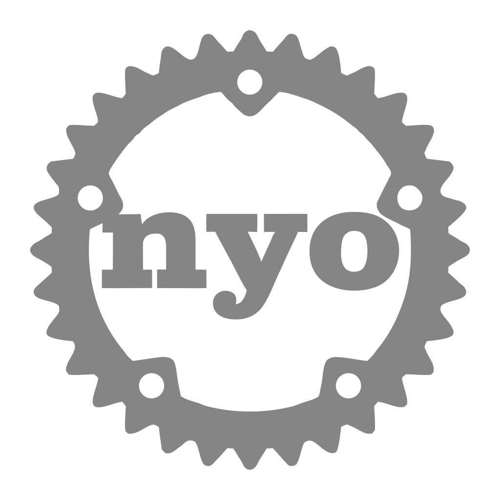

<p align="center">
  
</p>

<h1 align="center">Adminyo</h1>

<p align="center">
  <a href="https://www.npmjs.com/package/@adminyo/cli"></a>
  <a href="https://github.com/felipeinf/adminyo/stargazers"></a>
</p>

<p align="center"><code>rust</code> · <code>admin</code> · <code>dashboard</code> · <code>yml</code> · <code>whitelabel</code></p>

Generic admin panel driven by YAML, backed by a Rust binary and a pre-built React UI. Distributed via npm with native optional dependencies.

## Requirements

- **End users**: Node.js 18+ (only for the npm wrapper that launches the native binary). No Node at runtime for the panel server.
- **Building from source**: Rust stable, Node 18+ for the UI build.

## Install

```bash
npm install @adminyo/cli
```

Version `@adminyo/cli` and every `@adminyo/cli-*` package with the same semver.

## User project (after `nyo init`)

```
./
  adminyo.yml
  envs.yml
  .env
  assets/
```

## Commands

| Command | Description |
|--------|-------------|
| `npx nyo init` | Scaffold `adminyo.yml`, `nyo.example.yml`, `envs.yml`, `.env.example`, `assets/` |
| `npx nyo dev` | Run panel (default `http://127.0.0.1:4321`) with hot-reload and proxy |
| `npx nyo dev --env=staging --port=8080` | Other env / port |
| `npx nyo validate` | Validate YAML without starting the server |
| `npx nyo build [--env=production] [--out=dist]` | Emit static `dist/` (`config.json` + SPA) for S3/Amplify/Vercel |

Static hosting: set `auth` in `adminyo.yml` so the SPA logs in against your API and stores the token in `sessionStorage`. The browser calls `baseUrl` directly; your API must allow CORS for the panel origin. Define `columns` per entity in YAML if the API is not reachable at build time (live inference is skipped for `nyo build`).


## REST conventions 

- **List**: `GET {entity.endpoint}` — JSON array at root or first object key whose value is an array of objects.
- **Detail**: `GET {endpoint}/{id}`
- **Create**: `POST {endpoint}` with JSON body
- **Update**: `PUT {endpoint}/{id}` with JSON body
- **Delete**: `DELETE {endpoint}/{id}`

## Pagination (when configured)

- **offset**: `?page=1&limit={pageSize}` (1-based page)
- **cursor**: `?cursor={token}` (opaque; first page omits `cursor`)

## Auth

- **`nyo dev` (default)**: `POST /auth/login` with JSON `{ "user", "pass" }`, JWT in httpOnly cookie `adminyo_token`.
- **`nyo dev` with `auth` in `adminyo.yml`**: login goes to your API; same cookie/JWT flow as above is not used for upstream (see schema).
- **`nyo build` (static)**: `POST {baseUrl}{auth.loginEndpoint}`; bearer token from `auth.tokenPath` in `sessionStorage`.
- `401` from the Nyo server includes `"source":"adminyo"` in JSON body; upstream API errors pass through without that field.
